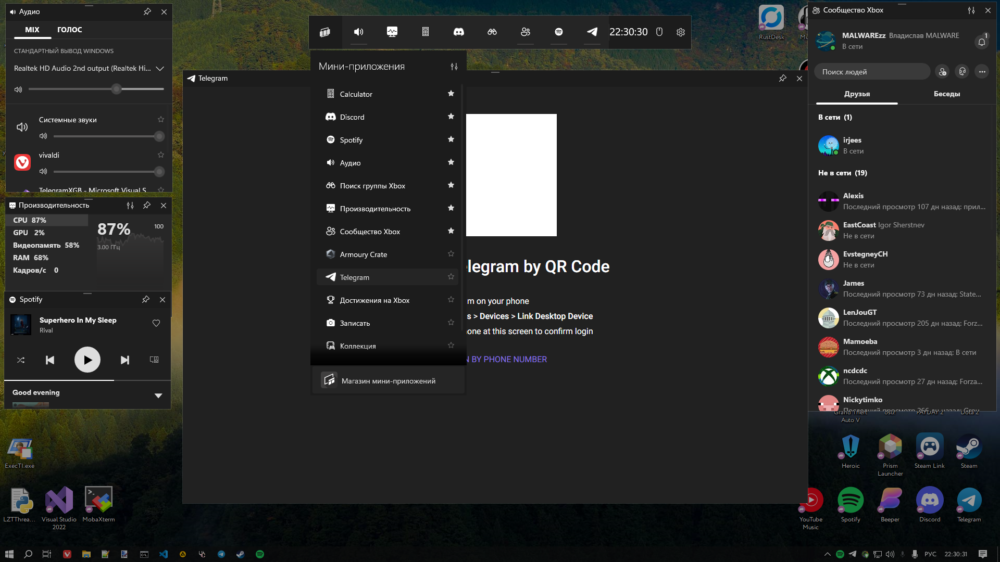

# Telegram widget for Xbox Game Bar

## Simple automatic installation
Go to [Releases](https://github.com/ImMALWARE/TelegramXGB/releases/latest) page, download [install.bat](https://github.com/ImMALWARE/TelegramXGB/releases/download/1.0/install.bat) and run it (it will download other files itself). Wait for it to install.
## Manual installation
Go to [Releases](https://github.com/ImMALWARE/TelegramXGB/releases/latest) page, download 5 .appx files, TelegramXGB.msixbundle and TelegramXGB.cer

Open PowerShell **as Administrator**, Set-Location to directory with all downloaded files.

1. Install certificate
```powershell
Import-Certificate -FilePath .\TelegramXGB.cer -CertStoreLocation Cert:\LocalMachine\TrustedPeople
```
2. Install .appx dependencies
```powershell
Add-AppxPackage -Path .\Microsoft.NET.Native.Framework.2.2.appx
Add-AppxPackage -Path .\Microsoft.NET.Native.Runtime.2.2.appx
Add-AppxPackage -Path .\Microsoft.UI.Xaml.2.8.appx
Add-AppxPackage -Path .\Microsoft.VCLibs.x64.14.00.appx
Add-AppxPackage -Path .\Microsoft.VCLibs.x64.14.00.Desktop.appx
```
3. Install DiscordXGB
```powershell
Add-AppxPackage -Path .\TelegramXGB.msixbundle
```
# How to use?
Press Win + G. It will open up Xbox Game Bar. Press first button at the top panel, and select **Telegram** to run it. You can click **Star** to pin it to the top panel.